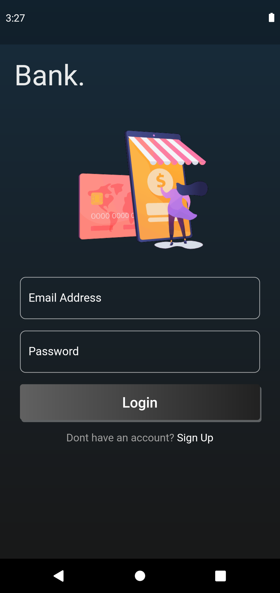
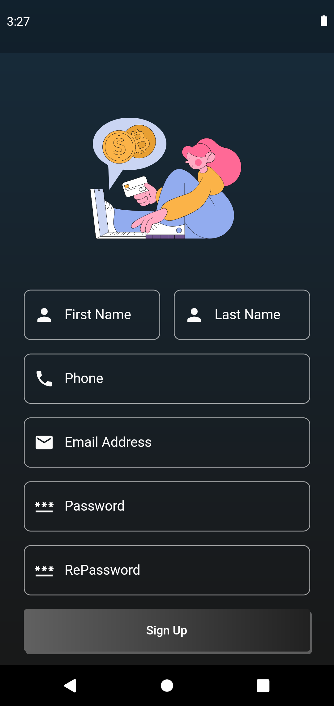
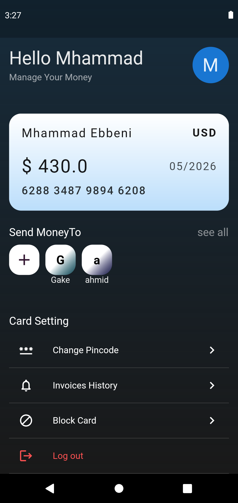
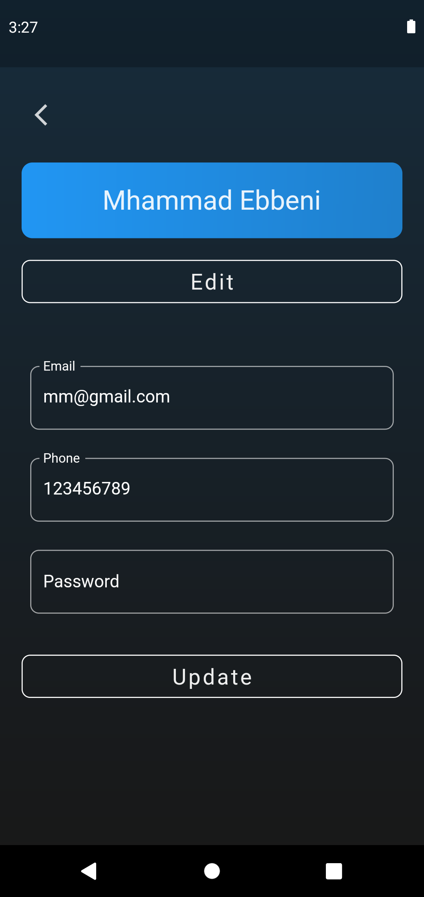
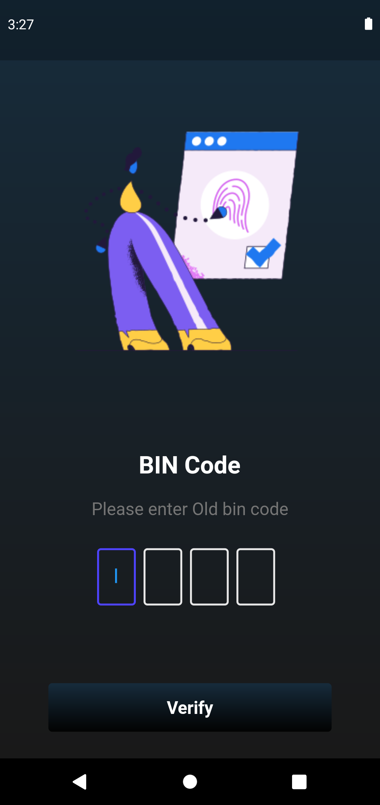
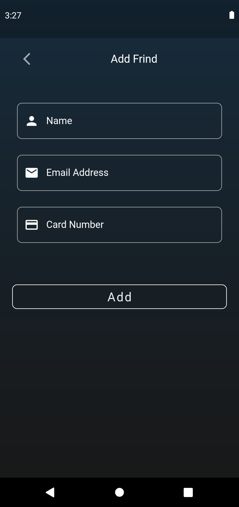
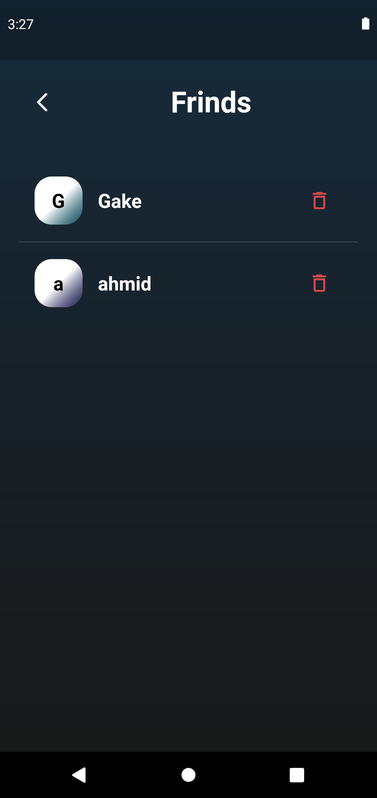
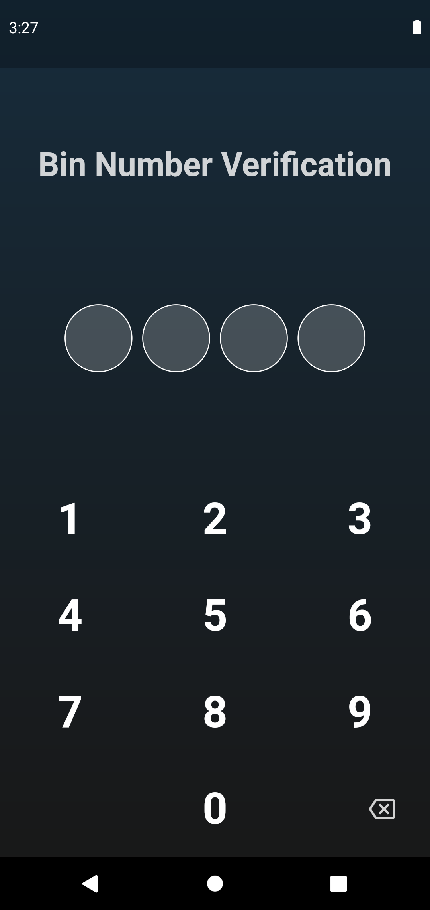
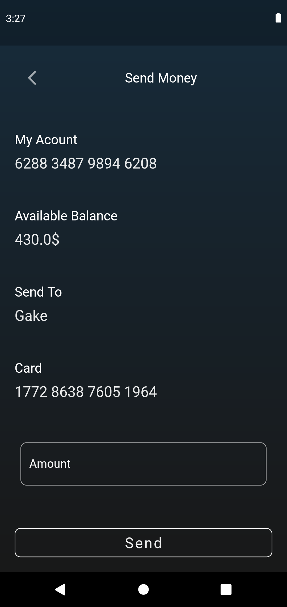

# Bank App  Flutter-Firebase

## Create an account, receive and send money, and follow up on bills

---

## Development Setup
Clone the repository and run the following commands:
```
git clone https://github.com/colonal/Google-DSC-Task.git
cd Google-DSC-Task
flutter pub get
```
### Firebase set up
Android add file  google-services.json
```
├── android
│   └── app
│       └── google-services.json
```
IOS add file  GoogleService-Info.plist
```
├── ios
│   └── Runner
│       └── GoogleService-Info.plist
```
Run App
```
flutter run
```
--- 

# ScreenShot
 
 
 
 
 
